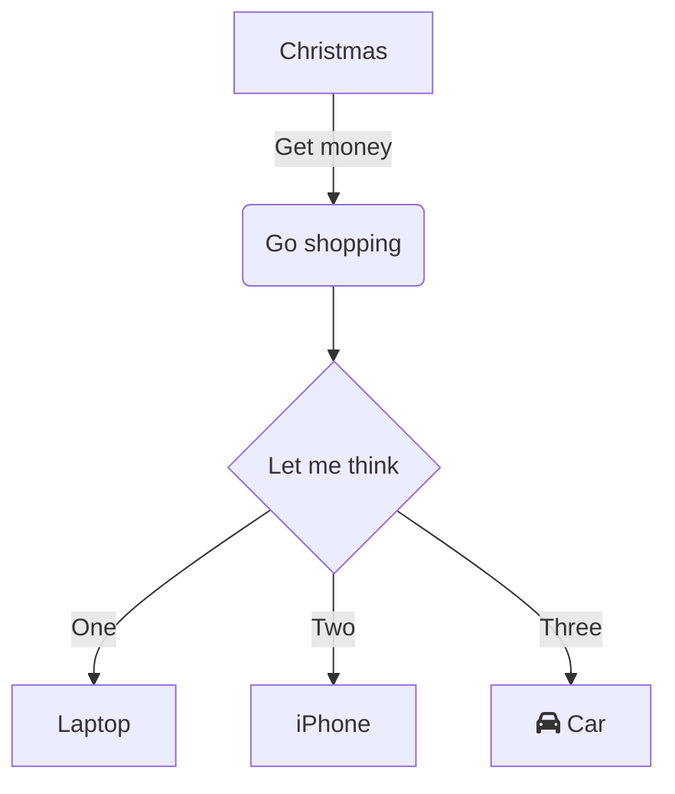

# Some Markdown Tips

Simply write sub topics here.

Did you know that you can write math equations here like this?

\\[ \mu = \frac{1}{N} \sum_{i=0} x_i \\]

The Master Method
\\[ 
  \begin{align}
  \text{If }  \quad  T(n) & <= a T (\frac{n}{b}) + O(n^d) \\\\ 
  \text{Then } \quad  T(n) & =
    \begin{cases}
      O(n^d \log n)       & \quad \text{if } a = b^d \text{ (Case 1)} \\\\
      O(n^d)              & \quad \text{if } a < b^d \text{ (Case 2)} \\\\
      O(n^{\log_{b}{a} }) & \quad \text{if } a > b^d \text{ (Case 3)}
    \end{cases}
  \end{align}
\\]

Looks pretty awesome. More info see [here][mdBook math]

### Add a table
```
|name   | length|
|----   |:-----:|
|oarfish| 10m?  |
```

|name   | length|
|----   |:-----:|
|oarfish| 10m?  |

### Add a image

You can sort of use github issue page to store some pictures perhaps?
```

```

### Hidden session
And a hidden session like this to hide a graph:
```html
<details>
<summary>Some hidden stuff here</summary>


</details>
```

<details>
<summary>Some hidden code here</summary>


</details>


### Embed an YouTube Video like this:
```html
<iframe width="640" height="360" 
    src="https://www.youtube.com/embed/WbzNRTTrX0g?t=1557" 
    frameborder="0" allow="accelerometer; autoplay; clipboard-write;
    encrypted-media; gyroscope; picture-in-picture" allowfullscreen>
</iframe>
```

### Mermaid graphs
See [here](https://mermaid-js.github.io/mermaid-live-editor/)
and [here](https://github.com/badboy/mdbook-mermaid).




[mdBook math]: https://rust-lang.github.io/mdBook/format/mathjax.html